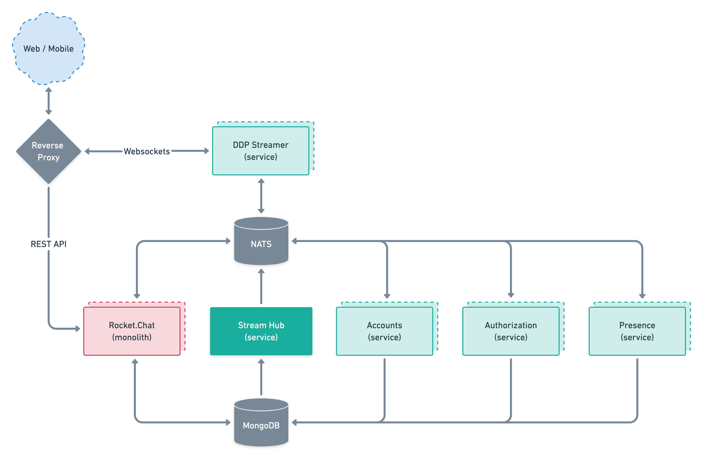

# Microservices Setup \[beta\]


This guide is currently only valid for a special distribution of the Rocket.Chat.

The feature will be released for **General Availability** on the **Enterprise Edition v4.0**


## Pre-requisites

* NATS
  * Please refer to [NATS Docker installation](https://docs.nats.io/nats-server/nats_docker) on how to deploy NATS
* MongoDB
  * Storage Engine needs to be [WiredTiger](https://docs.mongodb.com/manual/core/wiredtiger/):
    * [Change Standalone to WiredTiger](https://docs.mongodb.com/manual/tutorial/change-standalone-wiredtiger/)
* Rocket.Chat
  * The setting **Use REST instead of websocket for Meteor calls** under _Admin &gt; General &gt; REST API_, _must_ be **enabled**.

The following environment variables should be set for Rocket.Chat services as well:

| Variable | Value | Description |
| :--- | :--- | :--- |
| `TRANSPORTER` | `nats://nats:4222` | NATS address |
| `DISABLE_WATCH_DB` | `true` | Disables internal DB watcher and rely on `mongodb-stream-hub` |
| `DISABLE_PRESENCE_MONITOR` | `true` | Disables presence monitoring and rely on the `presence-service` |
| `INTERNAL_SERVICES_ONLY` | `true` | Do not run external services on rocket.chat process |

## Micro services

Rocket.Chat micro services are composed by a few Docker containers:



### Accounts


Can be scaled to multiple containers


Responsible for user authentications

```text
docker run \
--name accounts-service \
-e MONGO_URL=mongodb://mongo/rocketchat?replicaSet=rs01 \
-e TRANSPORTER=nats://nats:4222 \
rocketchat/account-service:latest
```

### Authorization


Can be scaled to multiple containers


Responsible for the validation of access to features

```text
docker run \
--name authorization-service \
-e MONGO_URL=mongodb://mongo/rocketchat?replicaSet=rs01 \
-e TRANSPORTER=nats://nats:4222 \
rocketchat/authorization-service:latest
```

### DDP Streamer


Can be scaled to multiple containers


Web socket interface between server and clients

```text
docker run \
--name ddp-streamer \
-e MONGO_URL=mongodb://mongo/rocketchat?replicaSet=rs01 \
-e TRANSPORTER=nats://nats:4222 \
rocketchat/ddp-streamer-service:latest
```

### MongoDB Stream Hub


Can not be scaled to multiple containers


Receives real time data from MongoDB and emits that data to the system.

```text
docker run \
--name mongodb-stream-hub \
-e MONGO_URL=mongodb://mongo/rocketchat?replicaSet=rs01 \
-e TRANSPORTER=nats://nats:4222 \
rocketchat/stream-hub-service:latest
```

### Presence


Can be scaled to multiple containers


Controls and update users' presence status.

```text
docker run \
--name presence-service \
-e MONGO_URL=mongodb://mongo/rocketchat?replicaSet=rs01 \
-e TRANSPORTER=nats://nats:4222 \
rocketchat/presence-service:latest
```

### Environment variables common to all services

Set the following environment variables to enable Prometheus metrics:

| Variable | Default | Description |
| :--- | :--- | :--- |
| `MS_METRICS` | `false` | Enable Prometheus metrics endpoint |
| `MS_METRICS_PORT` | `9458` | Port of Prometheus metrics endpoint |

## Reverse proxy

Once all services are up and running the web socket connections should be targeted to `ddp-streamer` containers, the configuration depends on the reverse proxy you have set up, but you need to change the following routes:

* `/sockjs`
* `/websocket`

If using Kubernetes, an Ingress like the following can be used:

```text
apiVersion: extensions/v1beta1
kind: Ingress
metadata:
  name: ddp-streamer
spec:
  rules:
  - host: your-hostname.rocket.chat
    http:
      paths:
      - backend:
          serviceName: ddp-streamer
          servicePort: 3000
        path: /(sockjs|websocket)
```

